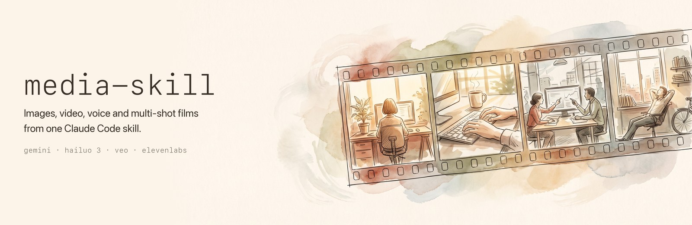
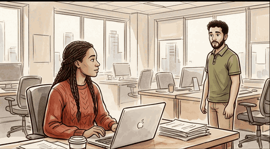
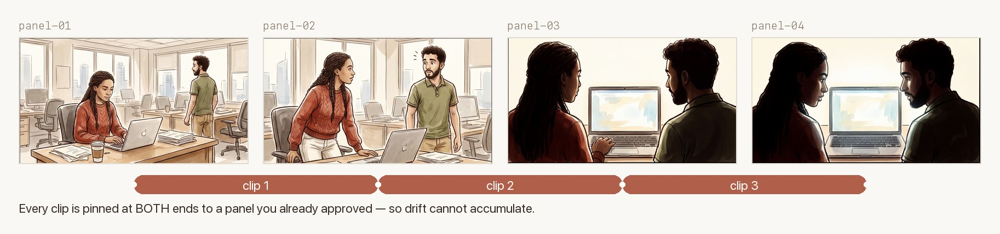
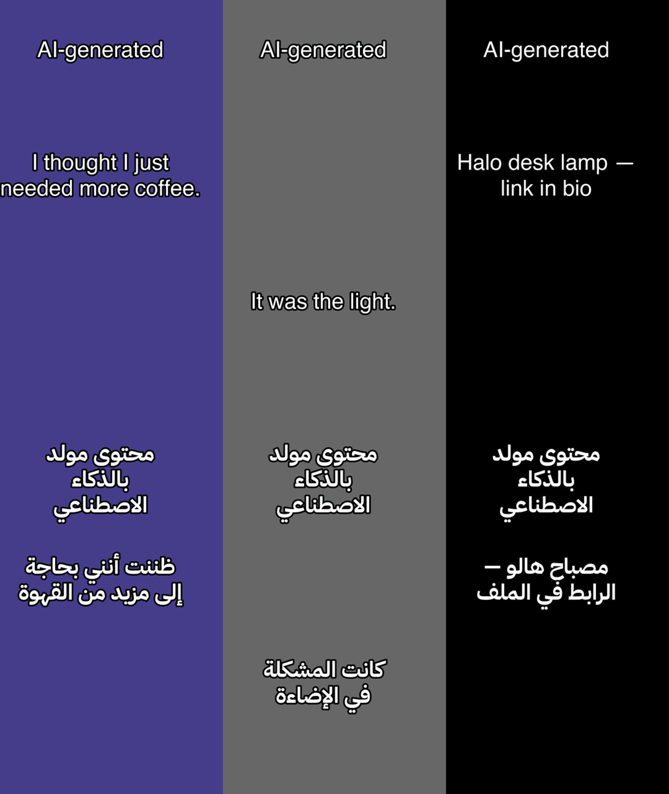

<div align="center">



<p>
  
  
  
  
</p>

<p>
  <a href="#quick-start">Quick start</a> ·
  <a href="#story-mode">Story mode</a> ·
  <a href="#social-ads">Social ads</a> ·
  <a href="#video">Video</a> ·
  <a href="#arabic-text">Arabic text</a> ·
  <a href="#configuration">Configuration</a> ·
  <a href="#cost">Cost</a>
</p>

</div>

A [Claude Code](https://claude.com/claude-code) skill that generates images, video clips and
voiceovers — and chains them into continuous multi-shot films, and platform-ready social
ads, from a single JSON shot list.

Say `/media` in Claude Code, or ask for a thumbnail, a voiceover, a product clip. The skill
picks the command, the model and the cost tier.

<div align="center">
  
  <br>
  <sub><b>Eight seconds of a generated film</b> — one JSON spec, two commands, no editing.<br>
  The cut in the middle is invisible because both clips were pinned to the same approved frame.</sub>
</div>

---

## Quick start

**Prerequisites:** [`uv`](https://docs.astral.sh/uv/) and a Gemini API key. Everything else is
optional and only needed for the backend you actually call.

```bash
git clone https://github.com/jneaimi/media-skill.git ~/.agents/skills/media
export GEMINI_API_KEY=...   # aistudio.google.com
```

Your first image, about ten seconds and four cents:

```bash
uv run $MEDIA/scripts/generate_media.py \
  image "A lighthouse at dusk, long exposure, muted palette" --aspect 16:9
```

Every example below uses `$S` for that path. Set it once and the rest are copy-pasteable:

```bash
S=$MEDIA/scripts/generate_media.py
```

Scripts declare their own dependencies inline, so `uv` installs them on first run. There is no
virtualenv to create and nothing to `pip install`.

---

## Story mode

The consistency problem in AI video is drift: generate nine clips and you get nine subtly
different characters. This solves it in two moves.

**One image, every shot.** All panels are drawn as cells of a *single* grid image, so they
share one palette, one lighting setup and one rendering of each character by construction —
not by asking nine separate generations to match. One image call, not nine.

**Both ends pinned.** Clip *i* is generated with panel *i* as its first frame and panel *i+1*
as its last, so every cut lands on art you already approved.

<div align="center">
  
</div>

Four phases, so you approve between them:

```bash
uv run $S story plan     spec.json   # every compiled prompt + total cost — spends nothing
uv run $S story board    spec.json   # one image call → grid → sliced panels
uv run $S story shots    spec.json   # chain the panels into clips
uv run $S story assemble spec.json   # ffmpeg concat → final film
```

**The cheap loop** (MiniMax direct only): draft every clip at 768P, keep what works, then
re-render only the keepers at 2K. Regeneration reuses the original result rather than
generating afresh, so the take you approved is the take you get — H3 has no seed, so a
plain re-submit at 2K would hand you a *different performance*.

```bash
uv run $S story shots      spec.json --provider minimax --resolution 768P   # $0.48/6s
uv run $S story regenerate spec.json                                        # $0.30/6s
```

Drafts are moved to `clips/drafts/` rather than overwritten. A keeper costs the same as
going straight to 2K ($0.78 for 6s); a **reject costs $0.48 instead of $0.78**.

A `manifest.json` records a sha256 of the spec, the board, every panel and every clip as it
goes, so a failure on clip 6 never loses clips 1–5. Re-roll a single shot with
`story shots spec.json --only <id>`.

The spec is plain JSON — a `style` for the whole film, a `cast` of reference images, and a
list of shots each carrying what to draw, what happens, one camera move and its sound layers:

```jsonc
{
  "version": 1, "model": "hailuo-3", "aspect": "16:9", "duration": 6,
  "style": "field-note illustration, loose ink over watercolour, muted earth palette",
  "cast":  { "sara": "cast/refs/ref-sara.jpg" },
  "shots": [
    { "id": "desk",
      "panel":  "wide shot of an open-plan office. Sara sits at a cluttered desk…",
      "action": "Sara stops typing and lifts her gaze",
      "camera": "slow push in",
      "sound":  { "ambience": "low office hum, a distant printer", "music": "N/A" } }
  ]
}
```

Text is suppressed by default. Both the board prompt and every clip prompt carry a guard
against rendering letters, captions and watermarks, because a model asked for a "cinematic
still" will otherwise sign it. **If the film is *about* text** — a chalkboard, a sign, a
scoreboard — set `"allow_text": true` on the spec, or on the single shot that needs it. Without
it the board is forbidden from drawing the one thing the film exists to show, and nothing
errors: you simply get a blank board.

[`examples/story-spec.json`](examples/story-spec.json) is a complete working spec — the film
above came from it. [`references/hailuo-prompting.md`](references/hailuo-prompting.md)
documents the prompt discipline the compiler encodes.

---

## Social ads

An ad spec **compiles into a story spec**, so everything above runs unchanged. Ad mode
adds the four things a story doesn't have: a named format, a platform safe zone, a product
that has to stay on-model, and burned-in text.

```bash
uv run $S ad plan     spec.json   # beat sheet, prompts, cues, cost — spends nothing
uv run $S ad preview  spec.json   # safe-zone guide + caption stills — spends nothing
uv run $S ad board    spec.json   # one image call → the panel grid
uv run $S ad shots    spec.json   # chain the panels into clips
uv run $S ad assemble spec.json   # concat + burn the text
```

**Ten formats**, each supplying an ordered beat skeleton and a duration split:

| | |
|---|---|
| **Actor-led** | `problem-solution` · `testimonial` · `unboxing` · `before-after` · `tutorial` |
| **Faceless** | `hero-product` · `asmr` · `kinetic-text` · `explainer` · `hands-demo` |

**The product problem, and where it's actually solved.** Video models can't hold a product
on-model from text — ask for "a woman holding a bottle of X" and the label is invented. So
the real packaging is composited into the *panel* at the image stage, and the video model
animates pixels that already contain it. That's the same move story mode makes for
character identity, pointed at a product.

**Safe zones are not decoration.** TikTok covers the top 10%, right 10% and bottom 20% of
the frame with its own UI. Text there is copy nobody reads. Every caption is laid out
inside the safe box, and `ad preview` draws you the guide before you've spent anything.

<div align="center">
  
  <br>
  <sub><b>The same 30-second ad in both languages.</b> AI image models cannot draw Arabic;
  these captions are real type, wrapped then reshaped, burned in with one ffmpeg pass.</sub>
</div>

**Hook variants — the cheap part.** The hook is beat 1, which is clip 1, so the body is
rendered once and reused:

```bash
uv run $S ad hooks spec.json --count 6
```

Six variants of a five-beat ad render **10 clips, not 30**. H3 has no seed, so the same
prompt returns a genuinely different performance each time — exactly what a hook test wants.

> [!NOTE]
> `"disclosure": true` burns an `AI-generated` mark for the whole film. The EU AI Act's
> Article 50 has required marking of synthetic media since 2 August 2026.

### Guided mode

Run inside Claude Code and the assistant asks once how you want to work — **direction-first**
(decide the look and the cast, then let production run), **guided** (stop at every phase),
**spend-gated** (stop only where money moves), or **headless** — then follows that for the
whole build.

The gates come in two acts. **Direction** happens before a spec exists and is where the film
is actually decided: three mood plates at $0.04 each to settle the palette and lighting, then
the cast — reuse a character from the bible in `cast/`, which is free and keeps continuity, or
generate a new reference sheet and pin it. Those answers *become* the spec's `style` and
`cast`, and every panel and clip inherits them.

**Production** is the phased chain, and its gates sit where the cost asymmetry is: the board
review puts ~$0.10 of artwork in front of ~$8–12 of video, and the rushes review is a free
ffmpeg rough cut you watch before paying for any re-roll.

Every gate renders its artifact before it asks, so you approve a picture rather than a
description. `SKILL.md` carries the full gate table.

The CLI itself never blocks — it is the same non-interactive tool in every mode, so batch
and agent use are unaffected.

---

## Motion — transitions, effects, overlays

Everything here is ffmpeg compositing. It costs nothing to render and nothing per run, so
it is the cheapest part of an ad to iterate on.

```bash
uv run $S ad motion                 # what THIS ffmpeg can actually do
uv run $S ad motion --kind gl       # just the GL ports
```

### Transitions

`spec.transition` sets the default cut; any beat can override it.

```json
"transition": { "type": "fade", "duration": 0.35 },
"beats": [
  { "id": "solution",
    "transition": { "type": "GL_DOORWAY", "duration": 0.5, "easing": "cubic-in-out" } }
]
```

Two catalogues, both resolved against your installed ffmpeg:

| Source | Count | Cost |
|---|---|---|
| **Native `xfade`** | 59 | threaded, fast — the default path |
| **Vendored expressions** | 106, of which 50 are [GL Transitions](https://gl-transitions.com) ports | needs `-filter_complex_threads 1` |
| **Easings** | 43 (Penner, plus squareroot/cuberoot/flipelastic/flipback) | applies to any of the 106 |

Naming an `easing` forces the expression path, because a native transition cannot be
eased — silently ignoring it would hand you a linear fade you did not ask for.

The expressions are vendored from [`scriptituk/xfade-easing`](https://github.com/scriptituk/xfade-easing)
(MIT) as plain FFmpeg strings, so **no custom ffmpeg build is required**. That is why this
was chosen over `ffmpeg-gl-transition`, which needs FFmpeg compiled with `--enable-opengl`
plus GLEW and glfw — not something a skill can ask of the person installing it.

> [!IMPORTANT]
> `xfade` **overlaps** its inputs rather than inserting between them, so every transition
> removes its own duration from the film. Four 0.35s cuts make a 30s ad 28.6s. Captions are
> re-timed for this automatically; the plan prints the total it will lose.

### Effects

Ten within-clip effects, authored per beat:

`flash` · `zoom_punch` · `shake` · `glitch` · `whip_blur` · `ken_burns` · `speed_ramp` ·
`vignette_pulse` · `color_pop` · `freeze_frame`

```json
{ "id": "proof",
  "effects": [{ "name": "zoom_punch", "at": 0.4, "duration": 0.6, "scale": 1.14 }] }
```

An effect with `at` is a moment and is rebased onto whichever clip contains it. An effect
without one is a treatment of the whole shot and applies to every clip of the beat.
`fps` is always overridden with the clip's measured rate — `zoompan` re-times to a wrong
one instead of resampling, which silently shortens the clip.

### Graphic overlays

Badges, arrows, plates and bars, animated with keyframe tracks over ten easing curves and
clamped into the platform safe box.

```json
"overlays": [
  { "badge": "50% OFF", "style": "starburst", "beat": "cta",
    "anchor": "center", "offset": [0.0, -0.22], "scale": 0.40,
    "fade_in": 0.25, "fade_out": 0.4,
    "tracks": [{ "prop": "scale", "easing": "back_out",
                 "keys": [{ "t": 26.0, "value": 0.0 },
                          { "t": 26.45, "value": 1.0 }] }] }
]
```

`beat: "<id>"` anchors an overlay to that beat's window, so it stays attached to its shot
when the allocation shifts. Graphics composite **before** captions, so the words are always
on top. Two overlays sharing pixels in the same time window produce a warning.

### Multi-clip beats

One clip is capped at the model's maximum (15s for H3). A beat that needs longer names
several panels and is rendered as that many clips:

```json
{ "id": "solution", "duration": 20,
  "panels": ["hands setting the lamp down beside the laptop",
             "the same desk moments later, warm light filling the frame"],
  "actions": ["she tilts the shade over the keyboard",
              "the light spreads and she eases back"] }
```

That is not only a way past the cap — it is what makes the longer beat worth its seconds.
The chain bridges panel *i* to panel *i+1*, so two panels is a shot that travels somewhere;
one panel stretched to 20s is a video model inventing 20 seconds of unaided motion, which
is exactly where H3 drifts.

> [!NOTE]
> **Clips inside one beat never get a transition.** They are bridge cuts — clip *i* ends on
> the frame clip *i+1* opens on — so a cross-dissolve there blends a frame with itself,
> costing runtime and showing nothing. A transition marks a deliberate discontinuity, and
> inside a beat there isn't one.

Skip any layer with `--no-transitions`, `--no-effects`, `--no-overlays`.

---

## Video

`--model` picks the model, `--provider` picks who serves it. Veo runs through the Gemini SDK;
Hailuo 3 runs over HTTP against **either** OpenRouter or MiniMax direct.

| `--model` | Backend | Resolution | Durations | Frames | Audio | Price |
|---|---|---|---|---|---|---|
| `fast` *(default)* | Gemini SDK · Veo 3.1 Lite | 720p / 1080p | 4, 6, 8 | first + last | ✅ | ~$0.15/s |
| `standard` | Gemini SDK · Veo 3.1 | 720p / 1080p / 4K | 4, 6, 8 | first + last | ✅ | ~$0.40/s |
| `hailuo-3` | OpenRouter · MiniMax | 2K *(768P direct)* | 5–15 *(4–15 direct)* | first + last | ✅ | $0.13/s *(768P $0.08/s)* |
| `hailuo-2.3` | OpenRouter | 1080p | 6, 10 | first only | ❌ | $0.0817/s |

```bash
uv run $S video "Aerial shot of a harbour at sunrise" --model fast --duration 6
uv run $S video "..." --model hailuo-3 --duration 6 --aspect 21:9
uv run $S video "..." --model hailuo-3 --provider minimax --resolution 768P --duration 4
uv run $S video "She opens the umbrella as the camera pulls back" \
  --model hailuo-3 --first-frame a.png --last-frame b.png
```

Parameters are checked against each backend's real capability set *before* anything is
submitted, so an unsupported duration fails instantly and free instead of as a paid 400.
Run `uv run $S caps --model hailuo-3` to see the live capability record.

> [!IMPORTANT]
> **Frames and references are different modes and cannot be combined.** That is a model-level
> rule, not a provider quirk — MiniMax rejects it and OpenRouter silently drops your
> references. The CLI refuses the combination instead. To get identity *and* frame control,
> bake identity into the frame images at the image stage, which is exactly what story mode does.

---

## Arabic text

AI image generators cannot render Arabic — they produce garbled, disconnected glyphs. The fix
is built in: generate the image *without* text, then composite real Arabic type on top with
`overlay`, which runs it through `arabic-reshaper` + `python-bidi` first.

```bash
# 1. background, no text
uv run $S image "Dark dramatic scene, no text" --aspect 16:9 --prefix bg

# 2. real Arabic on top — connected letters, correct RTL
uv run $S overlay ~/generated_media/bg_*.png \
  --text "تحذير!" "احذر قبل أن تشتري" \
  --position top bottom --size 80 --stroke-width 4
```

English text in prompts works fine and needs none of this.

---

## Configuration

Set only the keys for backends you call. Each is checked where it is used and names itself in
the error.

| Variable | Needed for | Get one |
|---|---|---|
| `GEMINI_API_KEY` | images, Veo video, story boards | [aistudio.google.com](https://aistudio.google.com) |
| `ELEVENLABS_API_KEY` | voiceover | [elevenlabs.io](https://elevenlabs.io) |
| `OPENROUTER_API_KEY` | `--model hailuo-*` | [openrouter.ai/keys](https://openrouter.ai/keys) |
| `MINIMAX_API_KEY` | `--provider minimax`, 768P tier | [platform.minimax.io](https://platform.minimax.io) |

Optional tools: `ffmpeg` (assembling films, normalising voice clips), `blender` (panel
rendering), `vtracer` + `svgo` (`--vectorize` for flat art).

<details>
<summary><b>Voice presets</b></summary>

<br>

Presets default to stock ElevenLabs voices; no voice ID is hardcoded to a person. Point any of
them at your own clone:

```bash
export ELEVENLABS_VOICE_MY_VOICE=<your voice id>
# also _ARABIC_MALE, _ARABIC_FEMALE, _ENGLISH_MALE, _ENGLISH_FEMALE
```

</details>

<details>
<summary><b>Everything else it does</b></summary>

<br>

| Command | Backend | Notes |
|---|---|---|
| `image` | Gemini Flash Image / 3 Pro | aspect ratios, 4K, up to 14 reference images, transparent background via difference matting, batch variations |
| `voice` | ElevenLabs v3 / Flash v2.5 | preset or raw voice IDs, EN + AR |
| `overlay` | Pillow + arabic-reshaper | correct Arabic text on images |
| `caps` | OpenRouter | live model capabilities |
| `render_scene.py` | headless Blender | declarative JSON scene spec → comic panels, with a sha256 provenance manifest |

`cast/` holds a reusable visual world for comic-style panels: named characters with pinned
voices, CC0 set and pose vocabularies, and a licence record for every asset pack. Character
models are not committed — `fetch_assets.sh` pulls the CC0 packs from Quaternius.

All output lands in `~/generated_media/` (override with `--output`), each file paired with a
`.meta.json` sidecar recording prompt, model, references and timestamp.

</details>

---

## Cost

| | |
|---|---|
| Image — `flash` / `pro` | ~$0.04 / ~$0.12 |
| Video — Veo `fast` / `standard` | ~$0.15/s / ~$0.40/s |
| Video — Hailuo 3 at 2K / 768P | $0.13/s / $0.08/s |
| Video — Hailuo 3 768P→2K regeneration *(direct only)* | $0.05/s |
| Voice — `v3` / `flash` | ~$0.30 / ~$0.15 per 1K chars |
| **The film at the top** — 1 board + 3 clips at 2K | **~$2.46** |
| **A 30s vertical ad** — 1 board + 5 clips at 768P | **~$2.52** |
| **…plus 6 hook variants** | **+~$2.88** *(10 clips, not 30)* |

> [!WARNING]
> Video costs 10–50× an image. Every paid call prints its estimate and waits for confirmation;
> `--yes` skips the prompt and is required in non-interactive runs. Run `story plan` first — it
> prices a whole film without spending anything.

Hailuo keepers cost the same on either provider; **rejects are what differ.** Drafting at 768P
on MiniMax direct and paying 2K only for shots you keep is the cheaper loop when you expect to
re-roll — which, on a chain, you will.

---

## License

MIT — see [LICENSE](LICENSE). Third-party assets referenced by the cast bible carry their own
licences, documented in [`cast/licenses.md`](cast/licenses.md).
